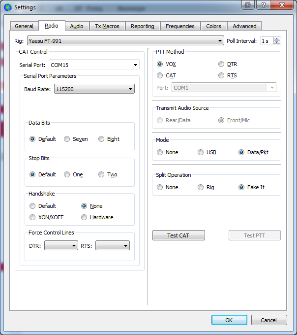
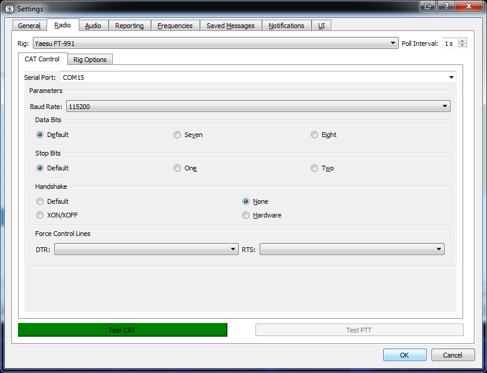
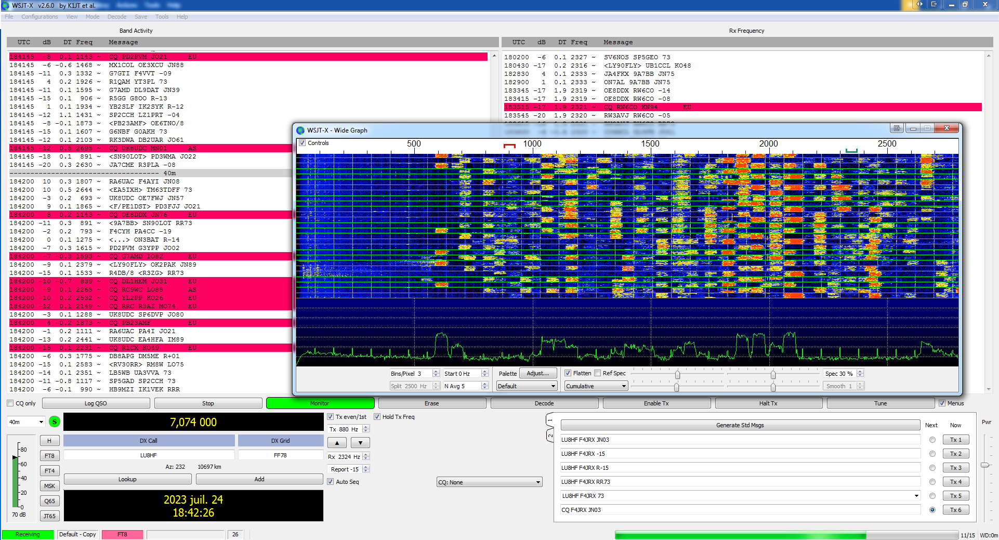
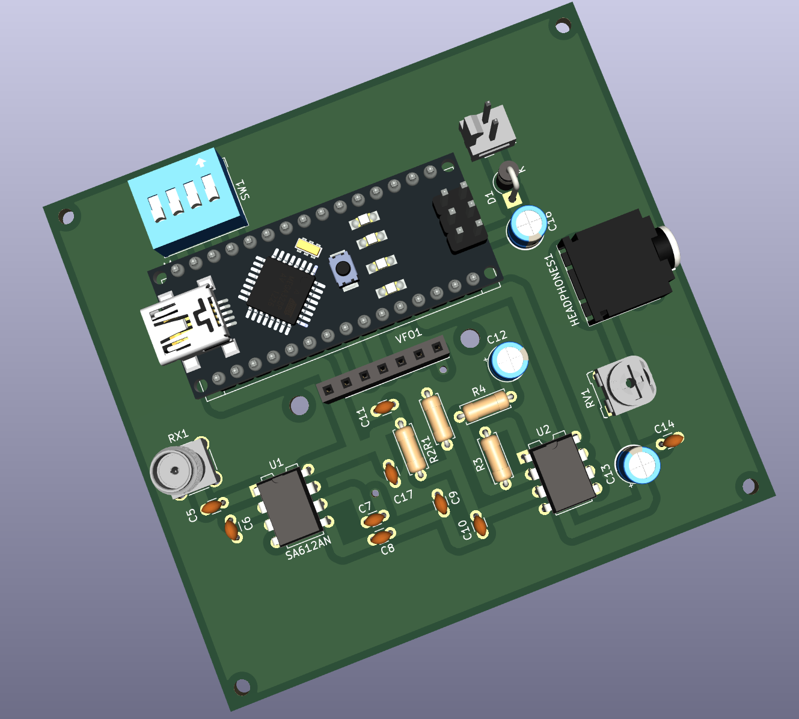
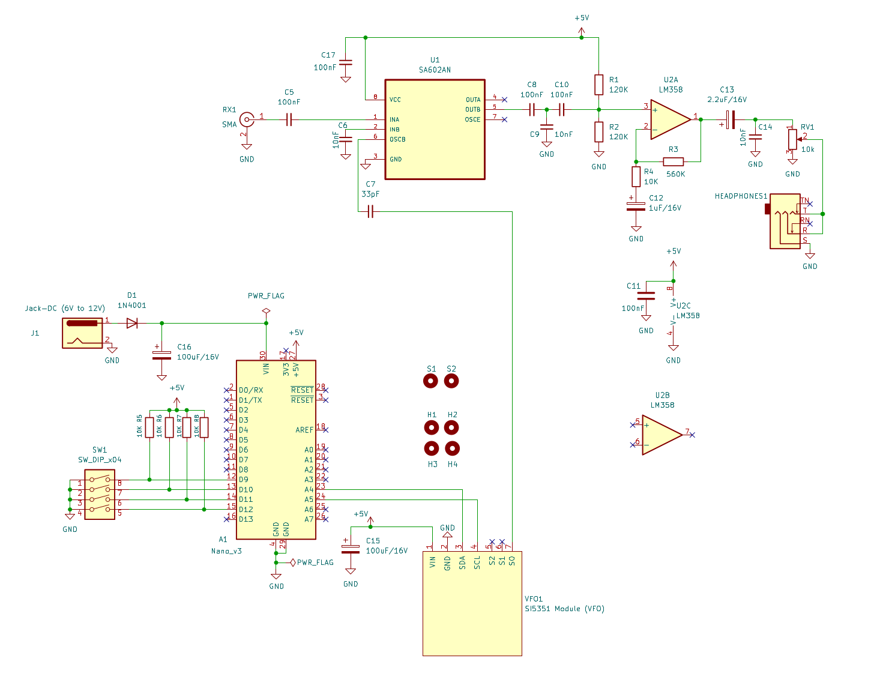

Easy-DCR-F4JRX Poor Man’s HF RX
===============================

A simple Arduino based direct conversion HF digital modes SSB receiver. 

This is a fork of WB2CBA's work from February 2020 : WB2CBA Barbaros Asuroglu.

The kit used for my developments was provided by F5KSE radio-club (http://ref31.r-e-f.org/) with the help of F4JQT (does not include the low-band filter).

The software from WB2CBA has been changed to :
1. Add support for CAT control over USB serial from WSJT-X and JS8Call
2. Rearrange DIP switch configuration to support multi-band operation

CAT Control operation
=====================

CAT Control is emulating a Yaesu FT-991.

WSJT-X and JS8Call should be configured as follows :
- Radio : Yaesu FT-991
- Baud rate : 115200
- Data bits : Default
- Stop bits : Default
- **Handshake : None** /!\ 

Configuration screen for WSJT-X :

Configuration screen for JS8Call :

DIP Switch configuration
========================
Swtich 0 and 1 are used for band selection.

Swtich 2 and 3 are used for mode selection.

Switch 0-1 = Band :
-------------------

| Switch   |  0   |   1   |
|:---------|:----:|------:|
|   80m    |  0   |   0   |
|   40m    |  0   |   1   |
|   30m    |  1   |   0   |
|   10m    |  1   |   1   |

Switch 2-3 = Mode :
-------------------

| Switch   |  2   |   3   |
|:---------|:----:|------:|
|   FT4    |  0   |   0   |
|   FT8    |  0   |   1   |
|   WSPR   |  1   |   0   |
|   JS8    |  1   |   1   |

Demonstration
=============
The board assembled and connected to the PC (USB Serial for CAT control and mic input jack for audio) and to my HWEF antenna :	

In action with WSJT-X in FT8 mode on 40m :

Assembly and build instructions
===============================
https://antrak.org.tr/projeler/poor-mans-hf-ssb-receiver-lets-build-it/

